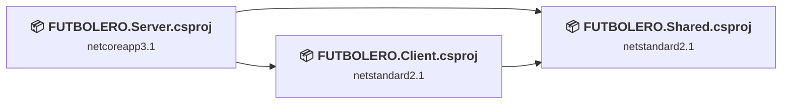
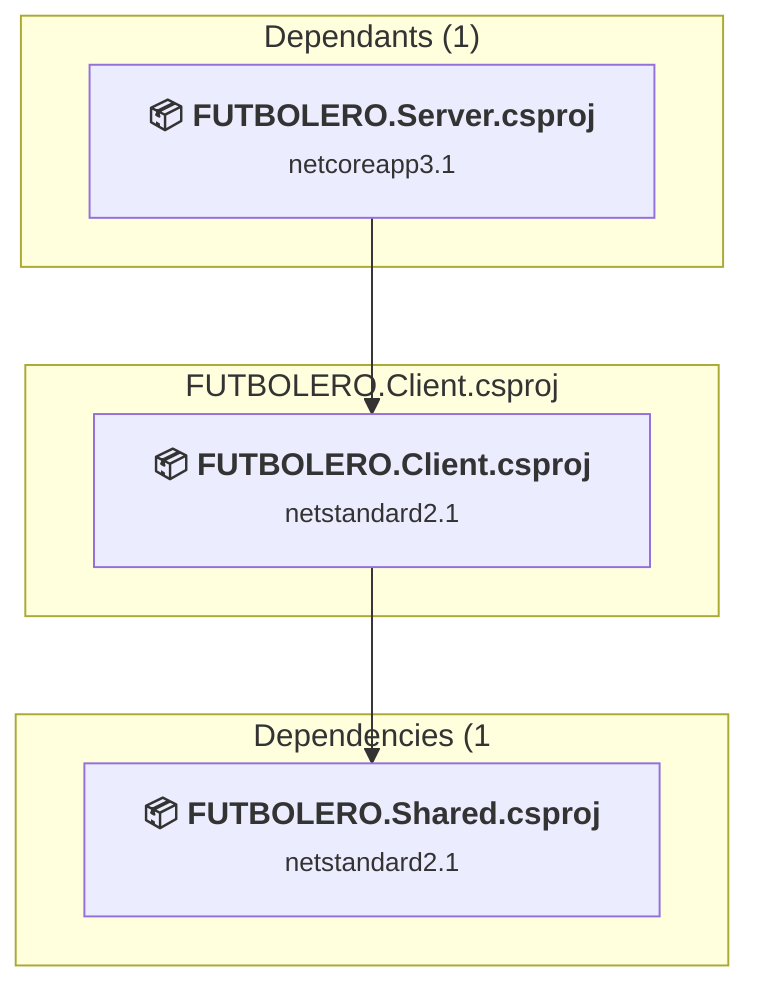
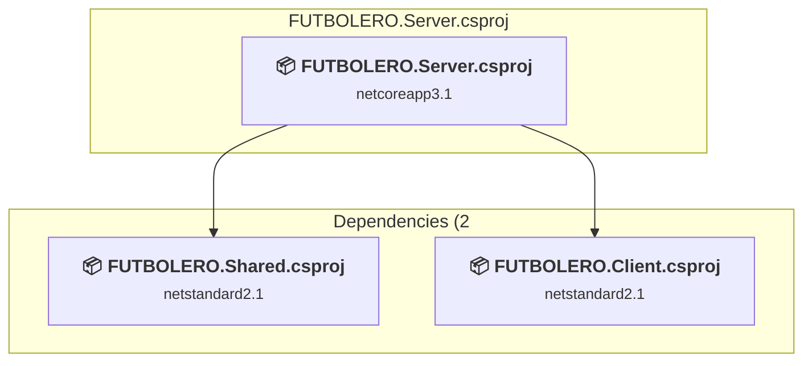
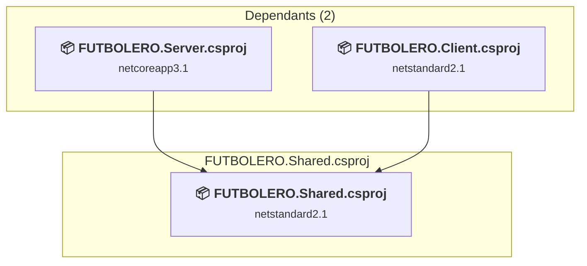

# Projects and dependencies analysis

This document provides a comprehensive overview of the projects and their dependencies in the context of upgrading to .NETCoreApp,Version=v10.0.

## Table of Contents

- [Executive Summary](#executive-Summary)
  - [Highlevel Metrics](#highlevel-metrics)
  - [Projects Compatibility](#projects-compatibility)
  - [Package Compatibility](#package-compatibility)
  - [API Compatibility](#api-compatibility)
- [Aggregate NuGet packages details](#aggregate-nuget-packages-details)
- [Top API Migration Challenges](#top-api-migration-challenges)
  - [Technologies and Features](#technologies-and-features)
  - [Most Frequent API Issues](#most-frequent-api-issues)
- [Projects Relationship Graph](#projects-relationship-graph)
- [Project Details](#project-details)

  - [Client\FUTBOLERO.Client.csproj](#clientfutboleroclientcsproj)
  - [Server\FUTBOLERO.Server.csproj](#serverfutboleroservercsproj)
  - [Shared\FUTBOLERO.Shared.csproj](#sharedfutbolerosharedcsproj)

## Executive Summary

### Highlevel Metrics

| Metric | Count | Status |
| :--- | :---: | :--- |
| Total Projects | 3 | All require upgrade |
| Total NuGet Packages | 12 | 8 need upgrade |
| Total Code Files | 118 |  |
| Total Code Files with Incidents | 8 |  |
| Total Lines of Code | 12587 |  |
| Total Number of Issues | 24 |  |
| Estimated LOC to modify | 12+ | at least 0.1% of codebase |

### Projects Compatibility

| Project | Target Framework | Difficulty | Package Issues | API Issues | Est. LOC Impact | Description |
| :--- | :---: | :---: | :---: | :---: | :---: | :--- |
| [Client\FUTBOLERO.Client.csproj](#clientfutboleroclientcsproj) | netstandard2.1 | 🟢 Low | 7 | 3 | 3+ | AspNetCore, Sdk Style = True |
| [Server\FUTBOLERO.Server.csproj](#serverfutboleroservercsproj) | netcoreapp3.1 | 🟢 Low | 3 | 9 | 9+ | AspNetCore, Sdk Style = True |
| [Shared\FUTBOLERO.Shared.csproj](#sharedfutbolerosharedcsproj) | netstandard2.1 | 🟢 Low | 1 | 0 |  | ClassLibrary, Sdk Style = True |

### Package Compatibility

| Status | Count | Percentage |
| :--- | :---: | :---: |
| ✅ Compatible | 4 | 33.3% |
| ⚠️ Incompatible | 1 | 8.3% |
| 🔄 Upgrade Recommended | 7 | 58.3% |
| ***Total NuGet Packages*** | ***12*** | ***100%*** |

### API Compatibility

| Category | Count | Impact |
| :--- | :---: | :--- |
| 🔴 Binary Incompatible | 0 | High - Require code changes |
| 🟡 Source Incompatible | 8 | Medium - Needs re-compilation and potential conflicting API error fixing |
| 🔵 Behavioral change | 4 | Low - Behavioral changes that may require testing at runtime |
| ✅ Compatible | 17728 |  |
| ***Total APIs Analyzed*** | ***17740*** |  |

## Aggregate NuGet packages details

| Package | Current Version | Suggested Version | Projects | Description |
| :--- | :---: | :---: | :--- | :--- |
| EPPlus | 5.7.4 |  | [FUTBOLERO.Client.csproj](#clientfutboleroclientcsproj) | ⚠️El paquete NuGet está en desuso |
| itext7 | 7.1.16 |  | [FUTBOLERO.Client.csproj](#clientfutboleroclientcsproj) | ✅Compatible |
| Microsoft.AspNetCore.Components.Authorization | 3.1.19 | 10.0.5 | [FUTBOLERO.Client.csproj](#clientfutboleroclientcsproj) | Se recomienda actualizar el paquete NuGet |
| Microsoft.AspNetCore.Components.WebAssembly | 3.2.1 | 10.0.5 | [FUTBOLERO.Client.csproj](#clientfutboleroclientcsproj) | Se recomienda actualizar el paquete NuGet |
| Microsoft.AspNetCore.Components.WebAssembly.Build | 3.2.1 |  | [FUTBOLERO.Client.csproj](#clientfutboleroclientcsproj) | La funcionalidad del paquete NuGet se incluye con la referencia del marco |
| Microsoft.AspNetCore.Components.WebAssembly.DevServer | 3.2.1 | 10.0.5 | [FUTBOLERO.Client.csproj](#clientfutboleroclientcsproj) | Se recomienda actualizar el paquete NuGet |
| Microsoft.AspNetCore.Components.WebAssembly.Server | 3.2.1 | 10.0.5 | [FUTBOLERO.Server.csproj](#serverfutboleroservercsproj) | Se recomienda actualizar el paquete NuGet |
| Microsoft.EntityFrameWorkCore.SqlServer | 3.1.1 | 10.0.5 | [FUTBOLERO.Server.csproj](#serverfutboleroservercsproj) | Se recomienda actualizar el paquete NuGet |
| Microsoft.EntityFrameWorkCore.tools | 3.1.1 | 10.0.5 | [FUTBOLERO.Server.csproj](#serverfutboleroservercsproj) | Se recomienda actualizar el paquete NuGet |
| Syncfusion.DocIO.Net.Core | 19.2.0.62 |  | [FUTBOLERO.Client.csproj](#clientfutboleroclientcsproj) | ✅Compatible |
| System.ComponentModel.Annotations | 5.0.0 |  | [FUTBOLERO.Shared.csproj](#sharedfutbolerosharedcsproj) | La funcionalidad del paquete NuGet se incluye con la referencia del marco |
| System.Net.Http.Json | 3.2.0 | 10.0.5 | [FUTBOLERO.Client.csproj](#clientfutboleroclientcsproj) | Se recomienda actualizar el paquete NuGet |

## Top API Migration Challenges

### Technologies and Features

| Technology | Issues | Percentage | Migration Path |
| :--- | :---: | :---: | :--- |
| Legacy Cryptography | 8 | 66.7% | Obsolete or insecure cryptographic algorithms that have been deprecated for security reasons. These algorithms are no longer considered secure by modern standards. Migrate to modern cryptographic APIs using secure algorithms. |

### Most Frequent API Issues

| API | Count | Percentage | Category |
| :--- | :---: | :---: | :--- |
| T:System.Security.Cryptography.SHA256Managed | 8 | 66.7% | Source Incompatible |
| T:System.Uri | 2 | 16.7% | Behavioral Change |
| M:System.Uri.#ctor(System.String) | 1 | 8.3% | Behavioral Change |
| M:Microsoft.AspNetCore.Builder.ExceptionHandlerExtensions.UseExceptionHandler(Microsoft.AspNetCore.Builder.IApplicationBuilder,System.String) | 1 | 8.3% | Behavioral Change |

## Projects Relationship Graph

Legend:
📦 SDK-style project
⚙️ Classic project

## Project Details

### Client\FUTBOLERO.Client.csproj

#### Project Info

- **Current Target Framework:** netstandard2.1✅
- **SDK-style**: True
- **Project Kind:** AspNetCore
- **Dependencies**: 1
- **Dependants**: 1
- **Number of Files**: 156
- **Number of Files with Incidents**: 2
- **Lines of Code**: 116
- **Estimated LOC to modify**: 3+ (at least 2.6% of the project)

#### Dependency Graph

Legend:
📦 SDK-style project
⚙️ Classic project

### API Compatibility

| Category | Count | Impact |
| :--- | :---: | :--- |
| 🔴 Binary Incompatible | 0 | High - Require code changes |
| 🟡 Source Incompatible | 0 | Medium - Needs re-compilation and potential conflicting API error fixing |
| 🔵 Behavioral change | 3 | Low - Behavioral changes that may require testing at runtime |
| ✅ Compatible | 90 |  |
| ***Total APIs Analyzed*** | ***93*** |  |

### Server\FUTBOLERO.Server.csproj

#### Project Info

- **Current Target Framework:** netcoreapp3.1
- **Proposed Target Framework:** net10.0
- **SDK-style**: True
- **Project Kind:** AspNetCore
- **Dependencies**: 2
- **Dependants**: 0
- **Number of Files**: 75
- **Number of Files with Incidents**: 5
- **Lines of Code**: 11386
- **Estimated LOC to modify**: 9+ (at least 0.1% of the project)

#### Dependency Graph

Legend:
📦 SDK-style project
⚙️ Classic project

### API Compatibility

| Category | Count | Impact |
| :--- | :---: | :--- |
| 🔴 Binary Incompatible | 0 | High - Require code changes |
| 🟡 Source Incompatible | 8 | Medium - Needs re-compilation and potential conflicting API error fixing |
| 🔵 Behavioral change | 1 | Low - Behavioral changes that may require testing at runtime |
| ✅ Compatible | 16092 |  |
| ***Total APIs Analyzed*** | ***16101*** |  |

#### Project Technologies and Features

| Technology | Issues | Percentage | Migration Path |
| :--- | :---: | :---: | :--- |
| Legacy Cryptography | 8 | 88.9% | Obsolete or insecure cryptographic algorithms that have been deprecated for security reasons. These algorithms are no longer considered secure by modern standards. Migrate to modern cryptographic APIs using secure algorithms. |

### Shared\FUTBOLERO.Shared.csproj

#### Project Info

- **Current Target Framework:** netstandard2.1✅
- **SDK-style**: True
- **Project Kind:** ClassLibrary
- **Dependencies**: 0
- **Dependants**: 2
- **Number of Files**: 42
- **Number of Files with Incidents**: 1
- **Lines of Code**: 1085
- **Estimated LOC to modify**: 0+ (at least 0.0% of the project)

#### Dependency Graph

Legend:
📦 SDK-style project
⚙️ Classic project

### API Compatibility

| Category | Count | Impact |
| :--- | :---: | :--- |
| 🔴 Binary Incompatible | 0 | High - Require code changes |
| 🟡 Source Incompatible | 0 | Medium - Needs re-compilation and potential conflicting API error fixing |
| 🔵 Behavioral change | 0 | Low - Behavioral changes that may require testing at runtime |
| ✅ Compatible | 1546 |  |
| ***Total APIs Analyzed*** | ***1546*** |  |

